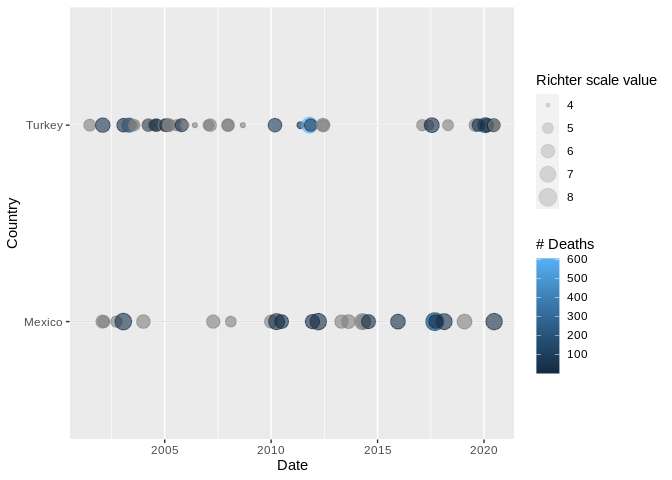
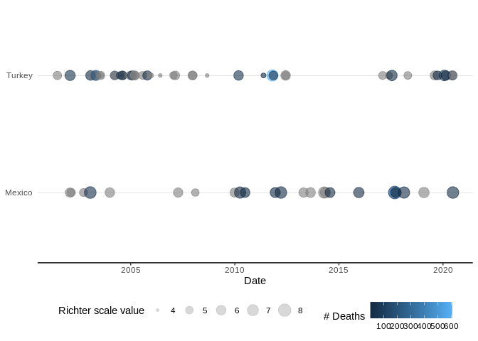
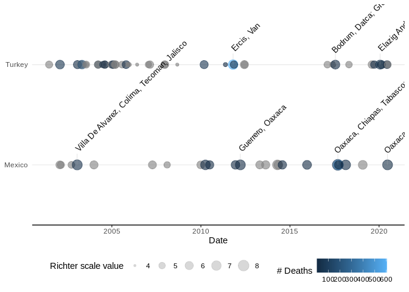
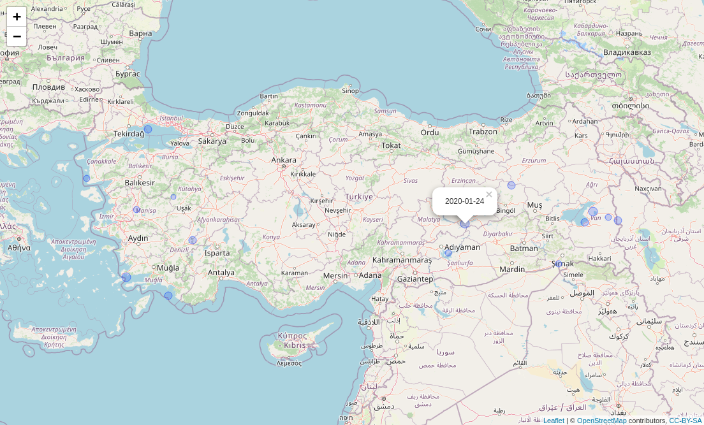

<!-- badges: start -->

[](https://travis-ci.com/csgbloom/NOAAearthquake)
<!-- badges: end -->

<!-- README.md is generated from README.Rmd. Please edit that file -->

# NOAA Earthquake Analysis

This package has been developed as part of the capstone module for
Coursera’s [Mastering Software Development in R
Specialization](https://www.coursera.org/specializations/r). This
package allows you to load earthquake data from the [US National Centers
for Environmental
Information](https://www.ngdc.noaa.gov/hazel/view/hazards/earthquake/search).
These data contains information on destructive earthquakes from 2150
B.C. to the present that meet at least one of the following criteria:

  - Moderate damage (approximately $1 million or more),
  - 10 or more deaths,
  - Magnitude 7.5 or greater,
  - Modified Mercalli Intensity X or greater, or the earthquake
    generated a tsunami.

## Installation

You can install the released version of the NOAA earthquake package by:

``` r
library(devtools)
#> Loading required package: usethis
install_github("csgbloom/NOAAearthquake")
#> Skipping install of 'NOAAearthquake' from a github remote, the SHA1 (202547e3) has not changed since last install.
#>   Use `force = TRUE` to force installation
library(NOAAearthquake)
```

## Examples

A vignette on how to use the package is available from
[here](vignettes/introduction.html)

The function **eq\_clean\_data()**:

  - loads the data file
  - creates a single `Date` field from the original `Year`, `Mo` and
    `Dy` fields, adding 01-01 where no month or day in original
data

<!-- end list -->

``` r
df1 <- eq_clean_data(system.file("extdata", "earthquakes.tsv", package = "NOAAearthquake"))
head(df1$Date)
#> [1] "-2150-01-01" "-2000-01-01" "-2000-01-01" "-1610-01-01" "-1566-01-01"
#> [6] "-1450-01-01"
```

The function **eq\_location\_clean()**:

  - splits and reformats the orginal `Location Name` field into
    `Location Name` and `Country`

<!-- end list -->

``` r
df2 <- eq_location_clean(df1)
head(df2$Country)
#> [1] "Jordan"       "Syria"        "Turkmenistan" "Greece"       "Israel"      
#> [6] "Italy"
```

The function **geom\_timeline()**:

  - generates a basic ggplot2 visualisation of the timeline of earth
    quakes for a given year range and country
  - the size of the marker is proportional to the magnitude of the
    earthquake
  - the colour of the marker is scaled according to the the total number
    of deaths caused by the earthquake

<!-- end list -->

``` r
library(tidyverse)
#> ── Attaching packages ─────────────────────────────────────── tidyverse 1.3.0 ──
#> ✓ ggplot2 3.3.3     ✓ purrr   0.3.4
#> ✓ tibble  3.1.0     ✓ dplyr   1.0.5
#> ✓ tidyr   1.1.3     ✓ stringr 1.4.0
#> ✓ readr   1.4.0     ✓ forcats 0.5.1
#> ── Conflicts ────────────────────────────────────────── tidyverse_conflicts() ──
#> x dplyr::filter() masks stats::filter()
#> x dplyr::lag()    masks stats::lag()
df2 %>% 
   dplyr::filter(Country %in% c("Mexico", "Turkey"), lubridate::year(Date) > 2000) %>% 
   ggplot2::ggplot(aes(x = Date, y = Country, color = `Total Deaths`, size = Mag)) +
   geom_timeline() +
   ggplot2::labs(size = "Richter scale value", col = "# Deaths")
```



The function **theme\_timeline()**:

  - applies a specified ggplot2 theme to the plot generated by
    **geom\_timeline()**

<!-- end list -->

``` r
df2 %>% 
   dplyr::filter(Country %in% c("Mexico", "Turkey"), lubridate::year(Date) > 2000) %>% 
   ggplot2::ggplot(aes(x = Date, y = Country, color = `Total Deaths`, size = Mag)) +
   geom_timeline() +
   theme_timeline() +
   ggplot2::labs(size = "Richter scale value", col = "# Deaths")
```



The function **geom\_timeline\_label()**:

  - applies `Location Name` labels to the earthquakes of the highest
    magnitude for that year range
  - the number of highest magnitude earthquakes to be labelled is
    specified `n_max`

<!-- end list -->

``` r
df2 %>% 
   dplyr::filter(Country %in% c("Mexico", "Turkey"), lubridate::year(Date) > 2000) %>% 
   ggplot2::ggplot(aes(x = Date, y = Country, color = `Total Deaths`, size = Mag)) +
   geom_timeline() +
   geom_timeline_label(aes(label = `Location Name`), n_max = 3) +
   theme_timeline() +
   ggplot2::labs(size = "Richter scale value", col = "# Deaths")
#> Warning: `group_by_()` was deprecated in dplyr 0.7.0.
#> Please use `group_by()` instead.
#> See vignette('programming') for more help
```



The function **eq\_map()**:

  - generates a Leaflet map plotting the earthquakes for a specified
    country and year range
  - marker popup labels are date (YYYY-MM-DD)

<!-- end list -->

``` r
df2 %>% 
   dplyr::filter(Country == "Turkey", lubridate::year(Date) >= 2010) %>%  
   eq_map(annot_col = "Date")
```



The function **eq\_create\_label()**:

  - generates popup labels with `Location`, `Magintude` and `Total
    Deaths` fields

<!-- end list -->

``` r
df2 %>% 
   dplyr::filter(Country == "Turkey", lubridate::year(Date) >= 2010) %>%  
   dplyr::mutate(popup_text = eq_create_label(.)) %>%
   eq_map(annot_col = "popup_text")
```


